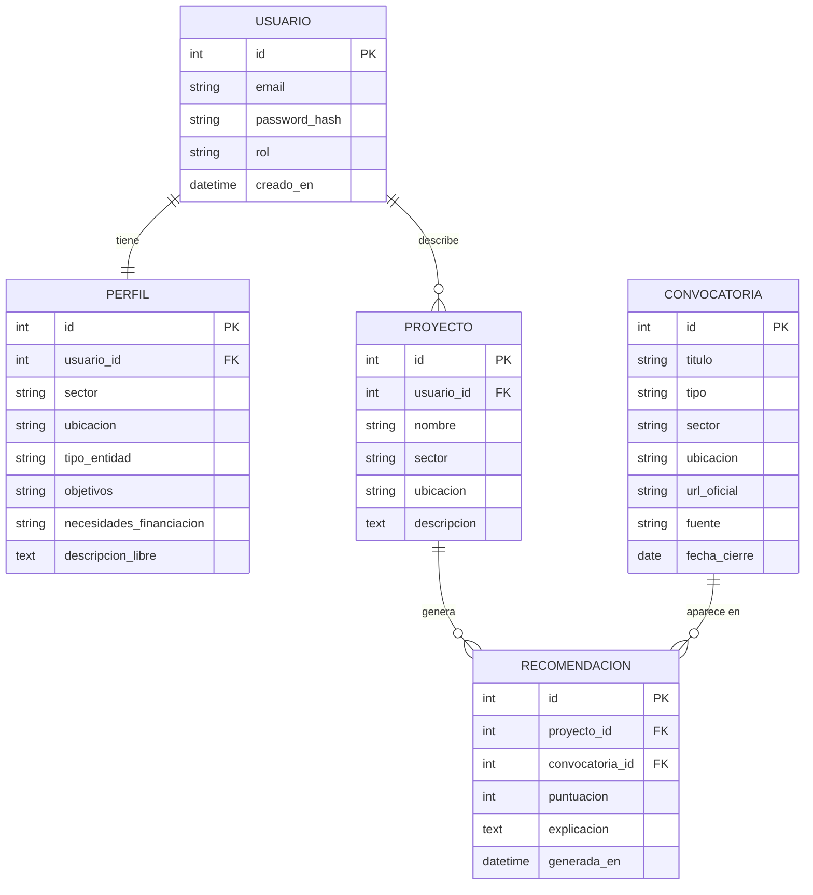
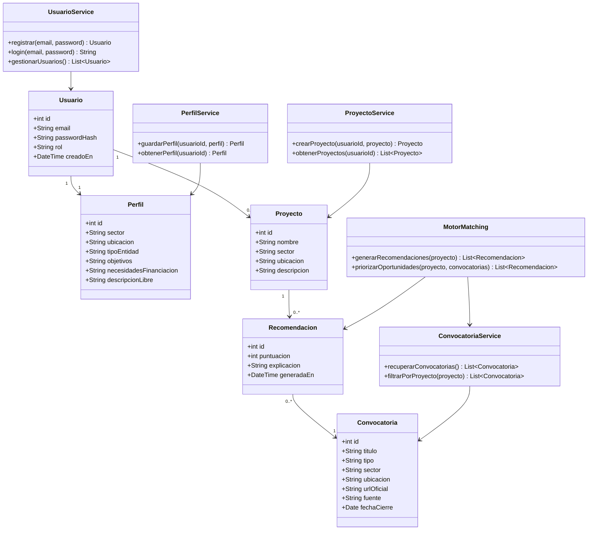
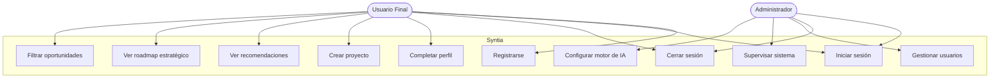
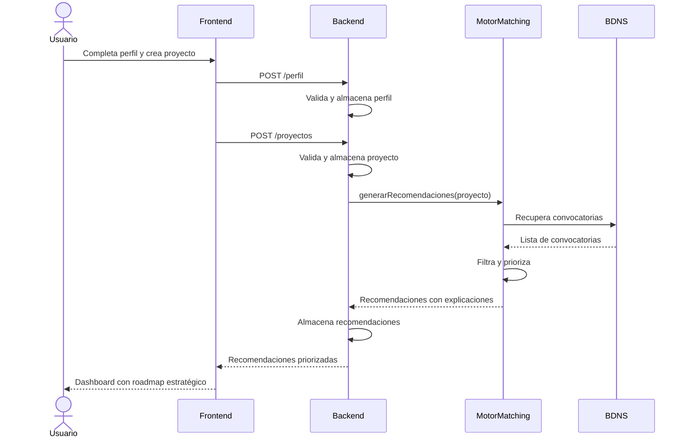

# Diagramas Syntia – Versión revisada y completa (2026-03-04)

---

## 1. Modelo Entidad-Relación (ER)

---

## 2. Diagrama de Clases UML

---

## 3. Diagrama de Casos de Uso UML

---

## 4. Diagrama de Secuencia UML – Flujo principal de recomendación

