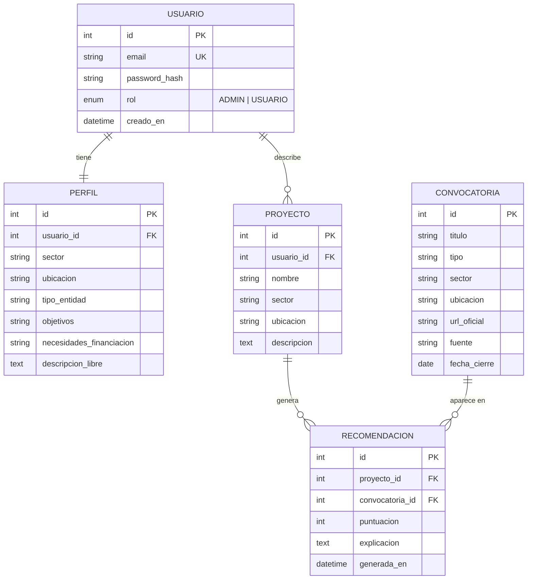
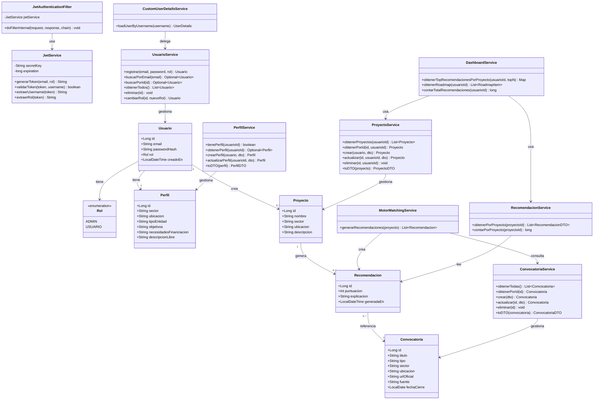
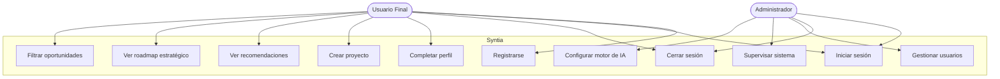
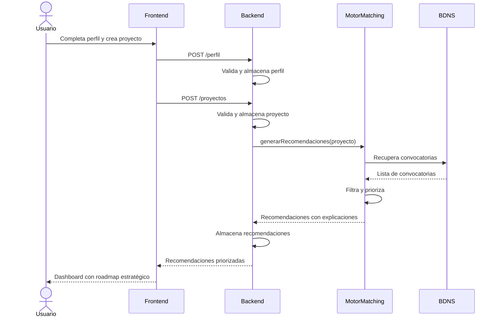
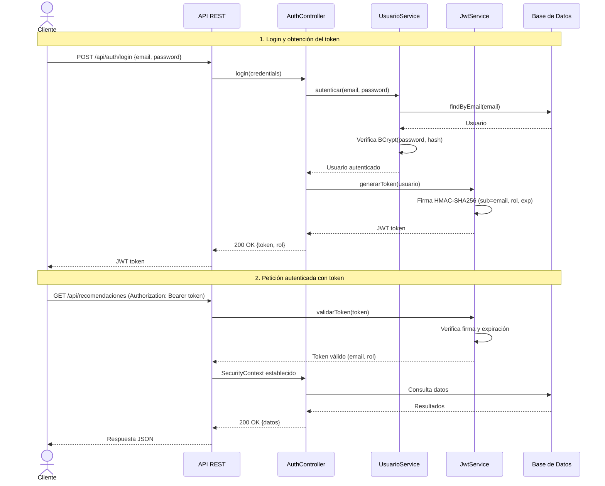
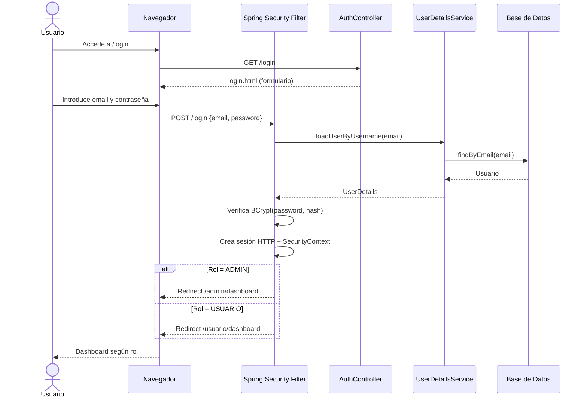

# Diagramas Syntia – Versión revisada y completa (2026-03-05)

---

## 1. Modelo Entidad-Relación (ER)

---

## 2. Diagrama de Clases UML

> **Actualizado a 2026-03-05** — Refleja el estado real de la implementación (fases 1–6).

---

## 3. Diagrama de Casos de Uso UML

---

## 4. Diagrama de Secuencia UML – Flujo principal de recomendación

---

## 5. Diagrama de Secuencia UML – Flujo de Autenticación JWT (API REST)

---

## 6. Diagrama de Secuencia UML – Flujo de Login por Formulario (Thymeleaf)

